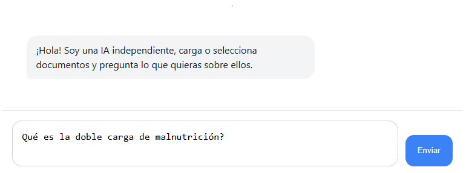
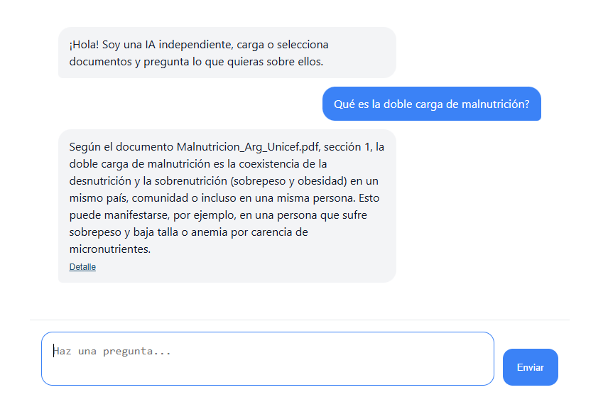
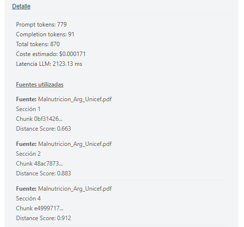
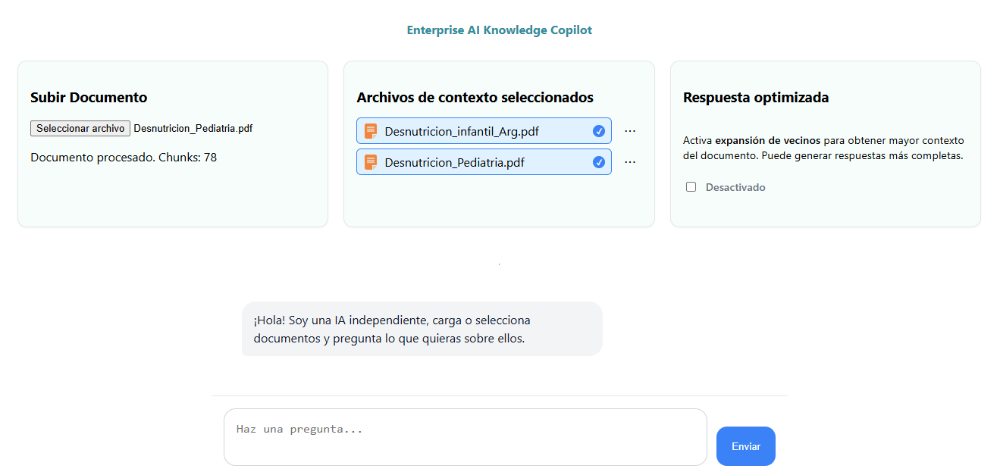
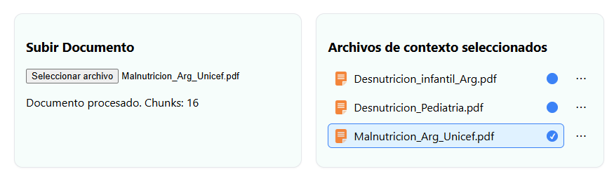
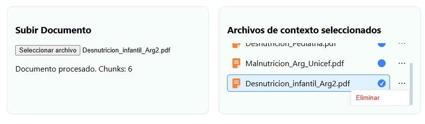
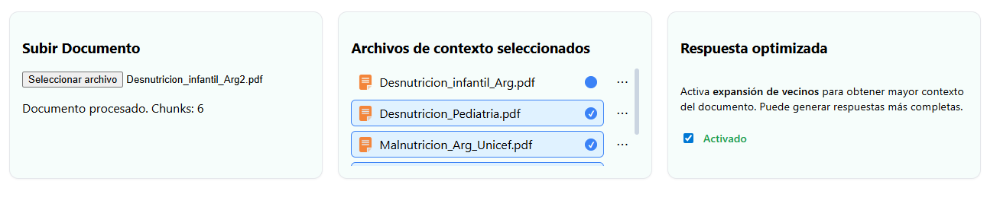

#  Enterprise RAG System – AI Engineer Portfolio Project

## Overview

This project is a **production-oriented Retrieval-Augmented Generation (RAG) system** built with a modern AI stack.
It allows users to upload documents, query them in natural language, and receive strictly grounded answers with structured citations.

The system includes:

* Document ingestion & chunking
* Embedding-based semantic retrieval
* Context-aware LLM generation
* Token control & cost estimation
* Source citation enforcement
* Recall@k evaluation pipeline
* Frontend chat interface with UX optimizations

## Live Demo

Frontend: https://enterprise-ai-copilot.vercel.app/
Backend API: https://enterprise-ai-copilot-backend-production.up.railway.app/health


---

## Example Query

User question:

> "What is the double burden of malnutrition?"

System retrieval:

Source: Malnutrition_Argentina_Unicef.pdf  
Section: 6  
Chunk: 14  
Score: 0.21  

LLM Answer:

> "Según el documento Malnutricion_Arg_Unicef.pdf, sección 6..."

---

# System Architecture

User
 ↓
Frontend (React)
 ↓
FastAPI Backend
 ↓
Embedding Generation
 ↓
Vector Database Search
 ↓
Top-k Retrieval
 ↓
Optional Neighbor Expansion
 ↓
Context Assembly
 ↓
LLM Generation
 ↓
Response + Metadata

---

## Architecture

### Backend

* **FastAPI** – API layer
* Modular service architecture
* Clear separation of concerns:

  * `retrieval_service`
  * `llm_service`
  * `evaluation`
  * `routes`

### AI Stack

* OpenAI Chat Model (configurable)
* Embeddings-based retrieval
* Vector database (Chroma or equivalent)

### Frontend

* React + TypeScript
* Chat-style interface
* Auto-resizing input
* Typing effect for assistant responses
* Multi-document selection
* Optimized retrieval toggle

---

# Core features

## 1. Document Ingestion Pipeline

* PDF upload support
* AES-encrypted PDF handling (cryptography dependency)
* Chunking strategy with metadata preservation
* Metadata stored per chunk:

  * source file
  * section
  * document id

---

## 2. Retrieval System

* Semantic similarity search
* Optional neighbor expansion (`expand_neighbors`)
* Multi-document filtering
* Token-aware context construction
* Preventive input token limit enforcement

### Token Safety Guard

Before calling the LLM:

* Context + question token estimation
* Hard limit (`MAX_INPUT_TOKENS_ALLOWED`)
* Graceful fallback if exceeded


---

## 3. LLM Guardrails

System prompt enforces:

* Strict grounding to provided context
* No hallucinations
* Mandatory citation format:

> "Según el documento {nombre}, sección {número}..."

If information is not found:

> "No lo sé, basándome en los documentos proporcionados"

Low temperature for deterministic answers.

---

## 4. Cost & Usage Tracking

Per request tracking:

* Prompt tokens
* Completion tokens
* Total tokens
* Estimated USD cost
* Latency (ms)

Pricing model configurable per 1K tokens.

This demonstrates cost-awareness — a critical skill in production AI systems.

---

## 5. Evaluation Framework

### Recall@k Implementation

Custom evaluation pipeline to measure retrieval quality.

* Manual dataset of evaluation questions
* Expected document mapping
* Top-k recall calculation
* API endpoint for evaluation

Example output:

```json
{
  "recall_at_k": 0.8,
  "correct": 8,
  "total": 10
}
```

This shows understanding of:

* Retrieval metrics
* Offline evaluation
* Separation of retrieval vs generation performance

---

# Engineering highlights

✔ Retrieval-Augmented Generation architecture
✔ Token management & cost optimization
✔ Structured logging capability
✔ Evaluation metrics
✔ Guardrails against hallucinations
✔ Clean modular backend design
✔ UX-aware frontend implementation

---

# Advanced concepts demonstrated

* Context window management
* Deterministic LLM prompting
* Metadata-aware chunk retrieval
* Latency measurement
* Cost estimation modeling
* Production-like error handling
* Config-driven model selection

---

# Project Structure

```
backend
│
├── app
│   │
│   ├── main.py
│   │
│   ├── core
│   │   ├── config.py
│   │   └── logging.py
│   │
│   ├── db
│   │   └── vector_store.py
│   │
│   ├── services
│   │   ├── embedding_service.py
│   │   ├── ingestion_service.py
│   │   ├── retrieval_service.py
│   │   └── llm_service.py
│   │
│   ├── routes
│   │   ├── routes_ask.py
│   │   ├── routes_upload.py
│   │   └── routes_delete.py
│   │
│   └── evaluation
│       └── recall_eval.py
│
├── chroma_db/
├── uploads/
├── requirements.txt
└── Dockerfile
```

```
frontend
│
└── client
    │
    ├── src
    │   ├── components
    │   │   ├── Chat.tsx
    │   │   ├── DocumentSelector.tsx
    │   │   ├── TypingMessage.tsx
    │   │   └── Message.tsx
    │   │
    │   ├── services
    │   │   └── api.ts
    │   │
    │   ├── App.tsx
    │   └── main.tsx
    │
    ├── package.json
    └── vite.config.ts
```
---
# Interface Preview

## Chat Interface





## Retrieval Details




## Document Management








---

# Why this project matters?

This project demonstrates practical AI engineering skills beyond prompt experimentation:

* Designing end-to-end AI systems
* Building evaluation pipelines
* Managing inference cost
* Implementing safety constraints
* Structuring scalable backend services

It reflects real-world AI product thinking, not just experimentation.

---

# Possible future improvements

* Precision@k and MRR metrics
* Automated answer quality evaluation
* Streaming responses
* Hybrid search (BM25 + embeddings)
* Multi-tenant support
* Role-based access control
* Deployment with Docker + CI/CD

---

# Author

AI Engineer Portfolio Project
Focused on Retrieval Systems, LLM Integration, and Production AI Design.


